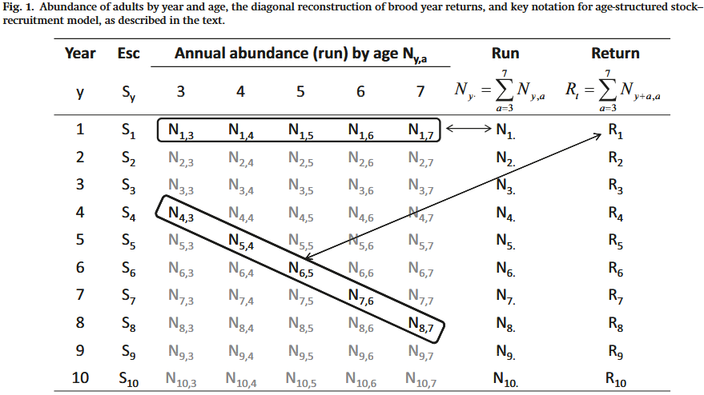

This document illustrates how to simulate some age-structured spawner recruitment data and then fit a Bayesian state-space spawner-recruitment model to it using Stan via [Rstan](https://cran.r-project.org/web/packages/rstan/vignettes/rstan.html). 
The state-space spawner-recruitment model used here is adapted from the model described in [Fleischman et al. 2013](https://cdnsciencepub.com/doi/full/10.1139/cjfas-2012-0112).

First load required libraries and function to simulate spawner-recruitment data.
```{r housekeeping, warning = FALSE, message = FALSE}
knitr::opts_chunk$set(echo = TRUE)
library(tidyverse)
library(here)
library(ggplotify) #for as.ggplot() to help mcmc_combo() plotting
library(rstan)
library(bayesplot)
source(here("functions.R"))
```

# Single population

## Static fits  

### Simulate data

Next, simulate some spawner-recruitment data assuming a Ricker type spawner recruitment relationship, and convert to dataframe. 
Feel free to manipulate these inputs, but note that if you change `a_min` and `a_max` you may need to update `mat` so its length equals the number of age classes (i.e. `n_a`). 
After we simulate, we also need to remove the first `a_max` years of data from this simulation, because these recruits do not have observations of spawners from their brood year to be linked to (i.e. these S-R years are not "fully observed"). 
See `process()` in `functions.R` and `indexing_explanation.xlsx` for details on this indexing.

```{r simulate}
# age and indexing pars
a_min <- 4               #minimum age
a_max <- 7               #maximum age
n_a <- a_max - a_min + 1 #number of age classes  
n_y_sim <- 40            #number of brood years to simulate

# SR pars
alpha <- 4                   #Ricker alpha (not in log space)
S_max <- 2000                #Spawners that maximize recruitment (i.e. 1/ricker beta)
phi <- 0.6                   #autocorrelation coefficient
mat <- c(0.2, 0.3, 0.4, 0.1) #maturity schedule, must sum to 1
sigma_R <- 0.5               #process variance
U_alpha <- 7                 #alpha shape parameter for beta distribution for annual harvest rate
U_beta <- 7                  #beta shape parameter ' ' 

#hist(rbeta(1000, U_alpha, U_beta)) #to test hist shape parameters 
# ADD REFIT THING HERE! Can't run new process on data AND use stored model 

#if(refit = TRUE){}...
sim_sr <- process(n_y = n_y_sim,
                  a_max = a_max,
                  alpha = alpha,                   
                  S_max = S_max,
                  phi = phi,                   
                  mat = mat, 
                  sigma_R = sigma_R,               
                  U_alpha = U_alpha,                 
                  U_beta = U_beta)                  

sim_data <- as.data.frame(sim_sr)[(a_max + 1):n_y_sim, ]  #remove partially observed years
sim_data$year <- 1:nrow(sim_data)

sim_data <- relocate(sim_data, year, 1)
```

The outputs of the function include spawner escapement (`S`), returns (i.e. run) by age (ages 4-7; `N_age.X`), total returns in the year of spawning (`N`, which corresponds to that return year's spawners + catch), and resulting recruitment (`R`) generated by that year's spawners.
This follows the same form as Table 1 in Fleishman et. al. (2013); but note that table uses *Esc* and *Return*, where we use *Spawners* (`S`) and *Recruitment* (`R`):

<center>

</center>

We can see how the dataframe we generated looks similar to this:

```{r view sim}
head(sim_data)
```

Before we try and fit a state-space model to the data let's just fit a simple linear Ricker model to the data and see what the relationship looks like.

```{r fit lm}
lm_Ricker <- lm(log(sim_data$R/sim_data$S)~sim_data$S)
lm_Ricker_a <- lm_Ricker$coefficients[1]
lm_Ricker_b <- lm_Ricker$coefficients[2]

S <- seq(0, max(sim_data$S), length.out = 100) #vector of spawner abundances to predict relationship

pred_R <- exp(lm_Ricker_a) * S * exp(lm_Ricker_b * S)
sr_pred <- as.data.frame(cbind(S, pred_R))

ggplot(data = sim_data, aes(x = S, y = R)) +
  geom_point() +
  xlim(0, NA) +
  ylim(0, NA) +
  geom_line(data = sr_pred, aes(x = S, y = pred_R), color="black", lwd = 1) +
  theme_bw()

```

The estimates of alpha (`r round(exp(lm_Ricker$coefficients[1]),2)`) and S_max (`r round(-1/lm_Ricker$coefficients[2], 2)`) are similar to the true values (`r alpha` and `r S_max`) but not identical. 


### Fit a state-space model

Before fitting the model we need to wrangle the simulated data into an appropriate format. 
First we need to generate a data frame of observed age composition over time, and specify it as integers with the sum of the rows equal to the effective sample size (ESS) for each year (for simplicity assumed to equal 100 *each year*, which wouldn't be the case if a field program collected different amounts of age data each year):

```{r scale A_obs}
A_obs <- sim_data |>
  mutate(age.4 = N_age.1/N,
         age.5 = N_age.2/N,
         age.6 = N_age.3/N,
         age.7 = N_age.4/N) |>
  select(age.4:age.7)

A_obs <- round(as.matrix(A_obs)*100) #then mult by 100 to scale for ESS 
```

And then specify a list of the data to be read when fitting the model: 

Most assessments read in data by return (i.e., calendar) years of spawners (`S_obs`), catch (or harvest; `H_obs`) then have some sort of estimate of the age structure (`A_obs`). 
We treat these simulated data like imperfect observations; the observation model within the state-space model estimates them with their respective errors, `S_CV` and `H_CV`. 
The values for `S_CV` and `H_CV` are assumed and constant, but they would ideally be empirically derived from run-reconstructions, or assumed based on known or qualitative biases in different sampling protocols. 
We also create a vector of recruitment observations with length `n_y_R = n_y + n_a - 1`. 
The recruitment vector is longer than `n_y` because it accounts for partially observed recruitment years (i.e., incomplete observations of numbers-at-age in the beginning and end of the recruitment time series).
See the [indexing explanation excel sheet](https://github.com/DylanMG/sim-salmon-sr-fit-stan/blob/main/indexing_explanation.xlsx) for a visual representation of how the indexing works and why `n_y` and `n_y_R` are different lengths.   

```{r stan data}
n_y <- length(sim_data$S) #number of spawning (i.e. calendar/return) years
n_y_R <- n_y + n_a - 1 #total number of not-fully-observed recruitment (i.e. brood) years needed to link S-R in the model

stan.data <- list("n_y" = n_y, #number of return years
                  "a_min" = a_min,
                  "a_max" = a_max,
                  "n_a" = n_a,
                  "n_y_R" = n_y_R,
                  "A_obs" = A_obs,
                  "S_obs" = sim_data$S,
                  "H_obs" = sim_data$N - sim_data$S,
                  "S_CV" = rep(0.2, n_y),
                  "H_CV" = rep(0.05, n_y))
```

The actual model is written out as a Stan program (see [SS-SR_AR1.stan](https://github.com/DylanMG/sim-salmon-sr-fit-stan/blob/main/Stan/SS-SR-AR1.stan)) which is then called when fitting the model using the `stan()` function.  

Toggle `refit` to `TRUE` or `FALSE` depending on if you need to fit the model for the first time, refit it with different parameters, or used a previously fit stored copy. 
We have put the model fit in the .gitignore because they are typically large and cannot be uploaded to GitHub; meaning the model fit will be stored locally on your machine. 
If this is your first time running this script R will fit the model to store a copy on your machine.  

```{r stan fit, message = FALSE}
refit <- TRUE # LEAVE TRUE TILL I FIX DATA!

if(refit == TRUE | !("SS-SR-AR1-stan-fit.rds" %in% list.files(here("output")))){
  stan.fit <- stan(file = "Stan/SS-SR-AR1.stan",
                 model_name = "SS-SR-AR1",
                 data = stan.data,
                 chains = 4,
                 iter = 1000,
                 seed = 1,
                 thin = 1,
                 control = list(adapt_delta = 0.99, max_treedepth = 20))
  saveRDS(stan.fit, file = here("output/SS-SR-AR1-stan-fit.rds"))
}else{
  stan.fit <- readRDS(here("output/SS-SR-AR1-stan-fit.rds"))
}

model_pars <- rstan::extract(stan.fit)
```

For brevity we have only run four chains for 1000 iterations. You will get some warnings that are all worth looking into, but we will ignore for now.

Shinystan is a great tool for interactive model examination and can be called by commenting out this code snipit:

```{r shinystan}
#shinystan::launch_shinystan(stan.fit) 
```

### Inference

Now that we have fitted our state-space model, let's see how well the posterior samples recover the true underlying parameters we used to simulate the data (red vertical lines):

```{r posterior check, message = FALSE}
post_df <- data.frame(
  parameter = factor(rep(c("lnalpha", "beta", "phi"), each=dim(model_pars$lnalpha))),
  posterior = c(model_pars$lnalpha, model_pars$beta, model_pars$phi)
  )

true_para_df <- data.frame(
  parameter = factor(c( "beta", "lnalpha", "phi")),
  value = c(1/S_max, log(alpha), phi)
  )

ggplot(post_df, aes(x = posterior)) + 
  geom_histogram() +
  facet_wrap(~ parameter, scales="free") +
  geom_vline(data = true_para_df, aes(xintercept=value), color = "red") +
  theme_bw()
```

And what does the inferred spawner-recruitment relationship look like?. First we need to generate a data frame of spawner abundance and predicted recruitment (with uncertainty) based on the posterior samples:

```{r get SR preds}
max_samples <- dim(model_pars$lnalpha)

spwn.quant <- apply(model_pars$S, 2, quantile, probs=c(0.05,0.5,0.95))[,1:(n_y-a_min)] #fully observed S

rec.quant <- apply(model_pars$R, 2, quantile, probs=c(0.05,0.5,0.95))[,(a_max+1):dim(model_pars$R)[2]] #fully observed R

brood_t <- as.data.frame(cbind(1:(n_y-a_min),t(spwn.quant), t(rec.quant)))
colnames(brood_t) <- c("BroodYear","S_lwr","S_med","S_upr","R_lwr","R_med","R_upr")

brood_t <- as.data.frame(brood_t)

# SR relationship
spw <- seq(0,max(brood_t$S_upr),length.out=100)
SR_pred <- matrix(NA,100,max_samples)

for(i in 1:max_samples){
  r <- sample(seq(1,max_samples),1,replace=T)
  a <- model_pars$lnalpha[r]
  b <- model_pars$beta[r]
  SR_pred[,i] <- (exp(a)*spw*exp(-b*spw))
}

SR_pred <- cbind(spw,t(apply(SR_pred,c(1),quantile,probs=c(0.05,0.5,0.95),na.rm=T)))
colnames(SR_pred) <- c("Spawn", "Rec_lwr","Rec_med","Rec_upr")
SR_pred <- as.data.frame(SR_pred)
```

And then plot the relationship:

```{r plot SR fit, warning = FALSE, echo = FALSE, message = FALSE}
ggplot() +
  geom_ribbon(data = SR_pred, aes(x = Spawn, ymin = Rec_lwr, ymax = Rec_upr),
              fill = "grey80", alpha=0.5, linetype=2, colour="gray46") +
  geom_line(data = SR_pred, aes(x = Spawn, y = Rec_med), color="black", size = 1) +
  geom_errorbar(data = brood_t, aes(x= S_med, y = R_med, ymin = R_lwr, ymax = R_upr),
                colour="grey", width=0, size=0.3) +
  geom_errorbarh(data = brood_t, aes(x= S_med, y = R_med, xmin = S_lwr, xmax = S_upr),
                 height=0, colour = "grey", height = 0, size = 0.3) +
  geom_point(data = brood_t, aes(x = S_med, y = R_med, color=BroodYear, width = 0.9), size = 3)+
  coord_cartesian(xlim=c(0, max(brood_t[,4])), ylim=c(0,max(brood_t[,7])), expand = FALSE) +
  scale_colour_viridis_c()+
  xlab("Spawners") +
  ylab("Recruits") +
  theme_bw() +
  theme(panel.grid.major = element_blank(),
        panel.grid.minor = element_blank(),
        legend.key.size = unit(0.4, "cm"),
        legend.title = element_text(size=9),
        legend.text = element_text(size=8))+
  geom_abline(intercept = 0, slope = 1,col="dark grey")
```

Then we will look at the timeseries of data that we fit. 
This is an important step to think of how the model is working, instead of just looking at the SR fit.  

```{r plot fit and obs, echo = FALSE, warning = FALSE}
quant <- c(.1, .25, .5, .75, .9)
spwn_quant <- as.data.frame(bind_cols(t(apply(model_pars$S, 2, quantile, probs = quant)), 
                        year = 1:n_y))
colnames(spwn_quant) <- c("S.1", "S.25", "S.5", "S.75", "S.9", "year")
harv_quant <- as.data.frame(bind_cols(t(apply(model_pars$C, 2, quantile, probs = quant)), 
                        year = 1:n_y))
colnames(harv_quant) <- c("H.1", "H.25", "H.5", "H.75", "H.9", "year")

prop_a_quants <- as.data.frame(cbind(rep(1:n_y, 3), 
                                     rep(4:7, each = n_y),
                                     rbind(t(apply(model_pars$q[,,1], 2, quantile, probs = quant)), 
                                     t(apply(model_pars$q[,,2], 2, quantile, probs = quant)),
                                     t(apply(model_pars$q[,,3], 2, quantile, probs = quant)),
                                     t(apply(model_pars$q[,,4], 2, quantile, probs = quant)))))
colnames(prop_a_quants) <- c("year", "age", "p.1", "p.25", "p.5", "p.75", "p.9")

p_obs <- as.data.frame(A_obs / 100) |>
  mutate(year = 1:n_y) |>
  pivot_longer(-year, names_to = "age", values_to = "prop") |>
  mutate(age = gsub("\\D", "", age))

# plot them --- 
ggplot(spwn_quant, aes(year, S.5)) +
  geom_ribbon(aes(ymin = S.1, ymax = S.9), fill = "grey") +
  geom_ribbon(aes(ymin = S.25, ymax = S.75), fill = "darkgrey") +
  geom_line() +
  geom_point(data = sim_data, aes(year, S)) +
  labs(y = "Spawner estimates (median [line], \n 50th and 90th percentiles), and data points")

ggplot(harv_quant, aes(year, H.5)) +
  geom_ribbon(aes(ymin = H.1, ymax = H.9), fill = "grey") +
  geom_ribbon(aes(ymin = H.25, ymax = H.75), fill = "darkgrey") +
  geom_line() +
  geom_point(data = sim_data, aes(year, N-S)) +
  labs(y = "Harvest estimates (median [line], \n 50th and 90th percentiles), and data points")

ggplot(prop_a_quants, aes(year, p.5)) +
  geom_ribbon(aes(ymin = p.1, ymax = p.9), fill = "grey") +
  geom_ribbon(aes(ymin = p.25, ymax = p.75), fill = "darkgrey") +
  geom_line() +
  geom_point(data = p_obs, aes(year, prop)) +
  facet_grid(age~.) +
  labs(y = "Prop. at age estimates (median [line], \n 50th and 90th percentiles), and data points")
```

## Time-varying productivity  

Now we need to simulate a population with true, underlying time-varying dynamics. 
We'll `source()` some functions to simulate dynamics from the [GitHub repo](https://github.com/Pacific-salmon-assess/nonstationarity-workshop-2026/tree/main) used in the Pacific Salmon Commission's time varying parameters workshop from early 2026. 

```{r tv}
source("https://raw.githubusercontent.com/Pacific-salmon-assess/nonstationarity-workshop-2026/refs/heads/main/functions/sim_functions.R")

#CAN i do this or do I need to bake into the numbers at age stuff? Feel like I could do that post-hoc

```

# Multiple populations  

There are several ways to fit this model to multiple populations, each with different layers of complexity. 
We will start simple by fitting a single model to two populations, essentially treating everything as fixed effects (i.e., no hierarchical components).  
This population will have the same age structure (i.e., `n_a, a_min, a_max, A_obs`) and number of years of assessment (i.e., `n_y`, `n_R_y`).  

```{r sim data 2 pops}
# simulating a new pop to merge with the one above 
alpha <- 2.5                 #Ricker alpha (not in log space)
S_max <- 4000                #Spawners that maximize recruitment (i.e. 1/ricker beta)
phi <- 0.8                   #autocorrelation coefficient
mat <- c(0.2, 0.3, 0.4, 0.1) #maturity schedule, must sum to 1
sigma_R <- 0.5               #process variance
U_alpha <- 7                 #alpha shape parameter for beta distribution for annual harvest rate
U_beta <- 7                  #beta shape parameter ' ' 

sim_sr <- process(n_y = n_y_sim,
                  a_max = a_max,
                  alpha = alpha,                   
                  S_max = S_max,
                  phi = phi,                   
                  mat = mat, 
                  sigma_R = sigma_R,               
                  U_alpha = U_alpha,                 
                  U_beta = U_beta)                  

sim_data_2 <- as.data.frame(sim_sr)[(a_max + 1):n_y_sim, ] |>
  mutate(year = 1:n_y, 
         pop = "b")

multi_sim_data <- sim_data |>
  mutate(pop = "a") |>
  rbind(sim_data_2)
```

We'll plot both populations to check

```{r plot pops}
lm_Ricker_2 <- lm(log(sim_data_2$R/sim_data_2$S)~sim_data_2$S)

S <- seq(0, max(sim_data_2$S), length.out = 100) #vector of spawner abundances to predict relationship

pred_R <- exp(lm_Ricker_2$coefficients[1]) * S * exp(lm_Ricker_2$coefficients[2] * S)
sr_pred_2 <- as.data.frame(cbind(S, pred_R)) |>
  mutate(pop = "b")

sr_preds <- sr_pred |>
  mutate(pop = "a") |>
  rbind(sr_pred_2)

ggplot(data = multi_sim_data, aes(x = S, y = R, color = pop)) +
  geom_point() +
  xlim(0, NA) +
  ylim(0, NA) +
  geom_line(data = sr_preds, aes(x = S, y = pred_R, color = pop), lwd = 1) +
  theme_bw()
```

Then prep the data for the Stan model.

```{r multi pop data}
n_pops <- length(unique(multi_sim_data$pop))

stan.data.multi <- list("n_pops" = n_pops, 
                        "n_y" = n_y,       #inherited from above
                        "n_y_R" = n_y_R, 
                        "a_min" = a_min,
                        "a_max" = a_max,
                        "n_a" = n_a,
                        "A_obs" = A_obs,
                        "S_obs" = as.matrix(cbind(sim_data$S, sim_data_2$S)), #new matrix of S obs
                        "H_obs" = as.matrix(cbind(sim_data$N - sim_data$S, 
                                                  sim_data_2$N - sim_data_2$S)),
                        "S_CV" = rep(0.2, n_y), #vector instead of matrix since they are the same for pops 
                        "H_CV" = rep(0.05, n_y))

if(refit == TRUE | !("multi-SS-SR-AR1-stan-fit.rds" %in% list.files(here("output")))){
  multi.stan.fit <- stan(file = "Stan/multi-SS-SR-AR1.stan",
                 model_name = "SS-SR-AR1",
                 data = stan.data.multi,
                 chains = 2,
                 iter = 500,
                 seed = 1,
                 thin = 1,
                 control = list(adapt_delta = 0.99, max_treedepth = 20))
  saveRDS(multi.stan.fit, file = here("output/multi-SS-SR-AR1-stan-fit.rds"))
}else{
  multi.stan.fit <- readRDS(here("output/multi-SS-SR-AR1-stan-fit.rds"))
}
```

Now we will do some simple diagnostics on this model. 

```{r multi diagnostics}
MS_fit_pars <- rstan::extract(multi.stan.fit)
MS_fit_summary <- as.data.frame(rstan::summary(multi.stan.fit)$summary)

for(i in 1:length(unique(multi_sim_data$pop))){
  p <- mcmc_combo(multi.stan.fit, pars = c(paste0("S_max[", i, "]"), paste0("lnalpha[", i, "]"),
                                   paste0("sigma_R[", i, "]"), paste0("phi[", i, "]")),
             combo = c("dens_overlay", "trace"),
             gg_theme = legend_none()) |>
    as.ggplot() + 
    labs(title = paste(unique(multi_sim_data$pop)[i], "Multi-stock AR1 leading parameters"))
  print(p)
}
  
  p <- mcmc_combo(multi.stan.fit, pars = c("D_scale"),
             combo = c("dens_overlay", "trace"),
             gg_theme = legend_none())|> 
    as.ggplot() +
    labs(title = "Multi-stock AR1 age pars (shared)")
    print(p)

  p <- mcmc_combo(multi.stan.fit, pars = c("Dir_alpha[1]", "Dir_alpha[2]", 
                               "Dir_alpha[3]", "Dir_alpha[4]"),
             combo = c("dens_overlay", "trace"),
             gg_theme = legend_none())|> 
    as.ggplot() +
    labs(title = "Multi-stock AR1 age probs (shared)")
    print(p)
            
#ESS and R-hat
print(paste("min ESS =", round(min(MS_fit_summary$n_eff, na.rm=T))))
print(paste("max. R-hat =", round(max(MS_fit_summary$Rhat, na.rm=T), 3)))

```

Then plot the fits

```{r multi-fits}

```


## Hierarchical models  

We can also try this multi-stock model with hierarchical productivity. **but need to simulate more stocks? (just to get a dist instead of 2)**

## Time-varying models  

And with hierarchical time-varying productivity, where a global time varying alpha is estimated and stocks get their own deviations. 